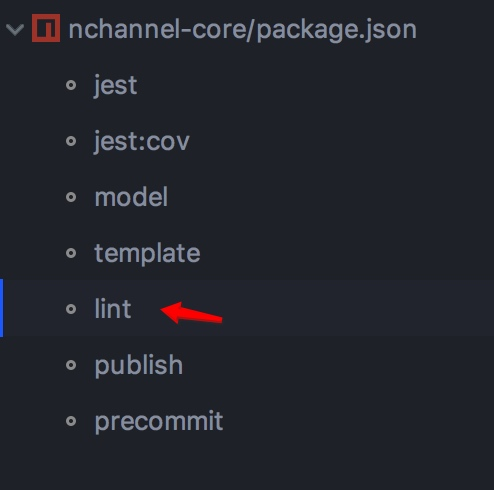
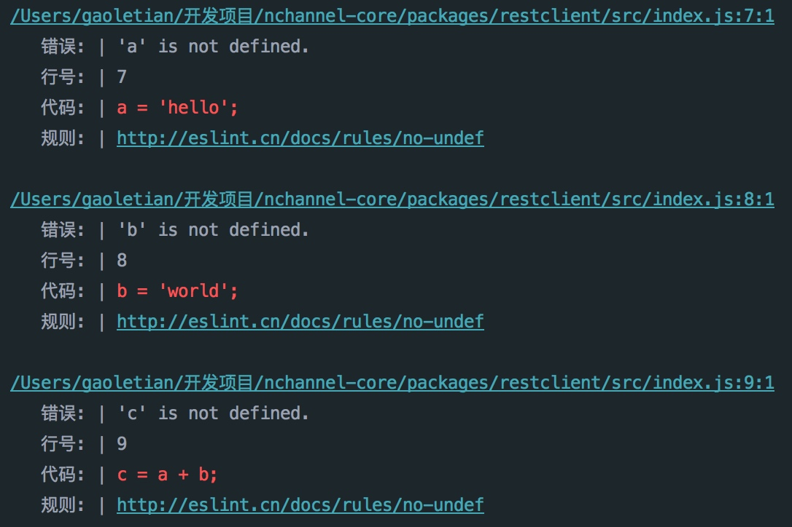
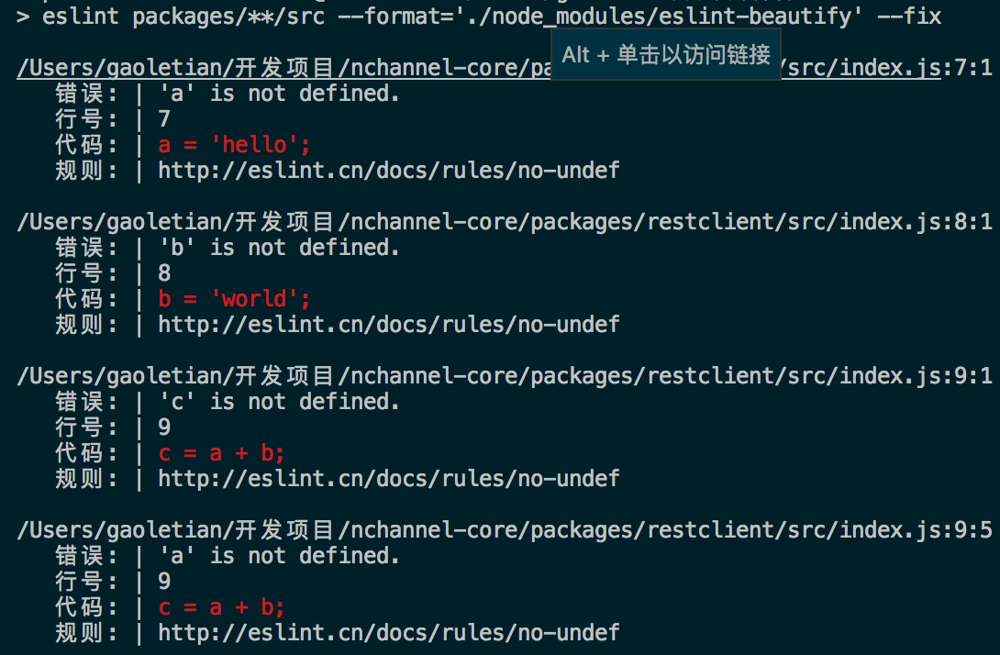

# 特性
- 鼠标点击快速定位到出错位置
- 快速链接相关规则的中文说明
- 显示出错行号及代码片断

# 安装
```bash
npm i eslint-beautify --save-dev
# or
yarn add eslint-beautify -D
```


# 用法
```
 // package.json
 ...
 "scripts": {
    "lint": "./node_modules/.bin/eslint src --format='./node_modules/eslint-beautify' --fix"
  }
  ...
```

## webstorm中运行

**npm 侧边工具栏**



**run面版显示结果**



## vscode中运行

